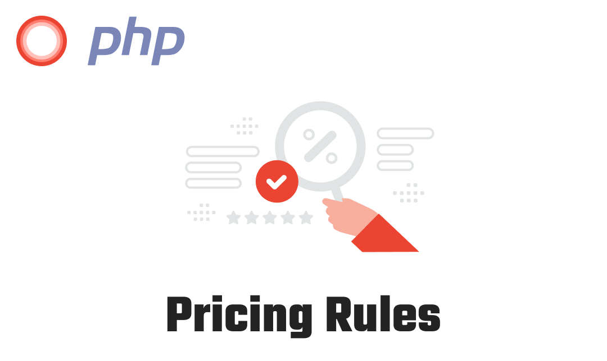

<p align="center"><a href="#" target="_blank"></a></p>

# PHP Pricing Rules

Create pricing rules that apply if the specified case matches.

## Install

```bash
composer require outmart/php-pricing-rules
```

## Example:-

```php
use OutMart\PricingRules\Lay;

$lay = new Lay;
$lay->setTotal(100);
$lay->setShippingMethod('COD');
$lay->setPaymentMethod('PayPal');

$lay->rule(function ($attributes) {
    if ($attributes['total'] >= 100) {
        return true;
    }
    return false;
}, function ($operations) {
    $total = $operations->getTotal();
    $total = $total * 0.9;
    $operations->setTotal($total);
});

return $lay->getTotal(); // 90
```
